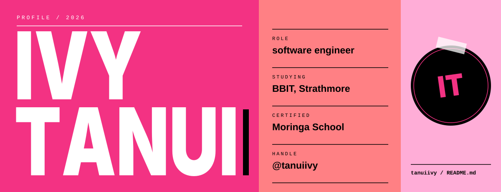
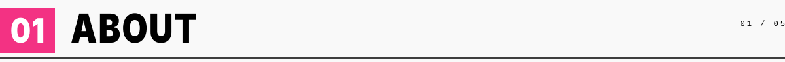
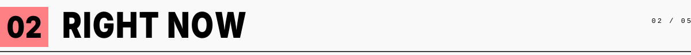
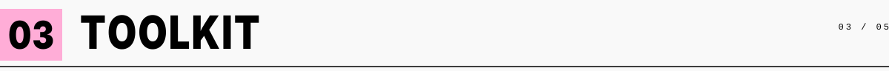
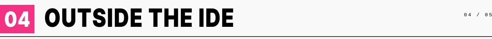
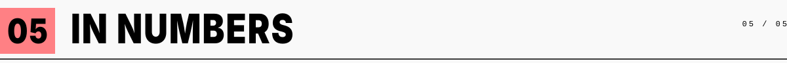
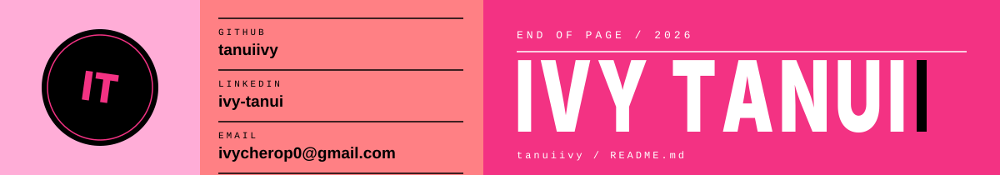

 

**I study how business and technology fit together, and I write the code in between.**

[github.com/tanuiivy](https://github.com/tanuiivy) &nbsp;/&nbsp; [linkedin.com/in/ivy-tanui](https://www.linkedin.com/in/ivy-tanui/) &nbsp;/&nbsp; [ivycherop0@gmail.com](mailto:ivycherop0@gmail.com)

 

<table>
<tr>
<td width="22%" valign="top"><code>CURRENTLY</code></td>
<td valign="top">Studying Business Information Technology (BBIT) at <b>Strathmore University</b></td>
</tr>
<tr>
<td valign="top"><code>BACKGROUND</code></td>
<td valign="top">Certified Software Engineer from <b>Moringa School</b></td>
</tr>
<tr>
<td valign="top"><code>INTERESTS</code></td>
<td valign="top">Software development, technology, building useful digital products</td>
</tr>
<tr>
<td valign="top"><code>LEARNING</code></td>
<td valign="top"><i>[add one thing you're learning right now]</i></td>
</tr>
</table>

 

<table>
<tr>
<td width="33%" valign="top"><code>BUILDING</code>  <i>[what you're building]</i></td>
<td width="33%" valign="top"><code>STUDYING</code>  <i>[a unit or topic you're deep in]</i></td>
<td width="33%" valign="top"><code>CURIOUS ABOUT</code>  <i>[something you keep reading about]</i></td>
</tr>
</table>

 

<table>
<tr>
<td width="22%" valign="top"><code>LANGUAGES</code></td>
<td valign="top"><i>[your languages, separated by ·]</i></td>
</tr>
<tr>
<td valign="top"><code>FRONTEND</code></td>
<td valign="top"><i>[your frontend tools]</i></td>
</tr>
<tr>
<td valign="top"><code>BACKEND</code></td>
<td valign="top"><i>[your backend tools]</i></td>
</tr>
<tr>
<td valign="top"><code>DATA</code></td>
<td valign="top"><i>[databases or data tools]</i></td>
</tr>
<tr>
<td valign="top"><code>TOOLS</code></td>
<td valign="top">Git · GitHub · <i>[more tools]</i></td>
</tr>
</table>

 

<table>
<tr>
<td width="22%" valign="top"><code>ON REPEAT</code></td>
<td valign="top"><i>[a song, album or podcast]</i></td>
</tr>
<tr>
<td valign="top"><code>READING</code></td>
<td valign="top"><i>[a book or article]</i></td>
</tr>
<tr>
<td valign="top"><code>SMALL JOYS</code></td>
<td valign="top"><i>[something specific you like]</i></td>
</tr>
<tr>
<td valign="top"><code>NOTE TO SELF</code></td>
<td valign="top"><i>[one honest line about how you like to work]</i></td>
</tr>
</table>

 

 

