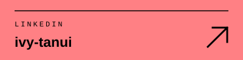
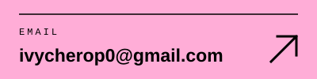
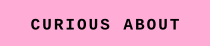

 

**I study how business and technology fit together, and I write the code in between.**

<table>
<tr>
<td width="33%"></td>
<td width="33%"></td>
<td width="33%"></td>
</tr>
</table>

 

<table>
<tr>
<td width="24%" valign="top"></td>
<td valign="top">Studying Business Information Technology (BBIT) at <b>Strathmore University</b></td>
</tr>
<tr>
<td valign="top"></td>
<td valign="top">Certified Software Engineer from <b>Moringa School</b></td>
</tr>
<tr>
<td valign="top"></td>
<td valign="top">Software development, building useful digital products, explainable AI, homelabbing, and reading books of all kinds</td>
</tr>
</table>

 

<table>
<tr>
<td width="33%" valign="top">  An event ticketing platform with a Flask backend and a React frontend</td>
<td width="33%" valign="top">  Explainable AI</td>
<td width="33%" valign="top">  Homelabbing</td>
</tr>
</table>

 

<table>
<tr>
<td width="24%" valign="top"></td>
<td valign="top">Python · JavaScript · SQL · Swift</td>
</tr>
<tr>
<td valign="top"></td>
<td valign="top">React · Vite · Tailwind CSS</td>
</tr>
<tr>
<td valign="top"></td>
<td valign="top">Flask</td>
</tr>
<tr>
<td valign="top"></td>
<td valign="top">Oracle · MS SQL Server · SSIS · Power BI · SHAP · LIME</td>
</tr>
<tr>
<td valign="top"></td>
<td valign="top">Check Point · VLANs · PuTTY · SolarWinds · Zabbix · Splunk</td>
</tr>
<tr>
<td valign="top"></td>
<td valign="top">UiPath · Visio · ServiceDesk Plus</td>
</tr>
<tr>
<td valign="top"></td>
<td valign="top">Git · GitHub</td>
</tr>
</table>

 

<table>
<tr>
<td width="24%" valign="top"></td>
<td valign="top">The Rest Is Science (podcast)</td>
</tr>
<tr>
<td valign="top"></td>
<td valign="top"><i>I See Buildings Fall Like Lightning</i> by Keiran Goddard</td>
</tr>
<tr>
<td valign="top"></td>
<td valign="top">Homelabbing, and any good book</td>
</tr>
</table>

 

 

